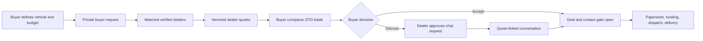
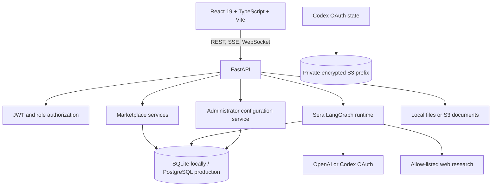
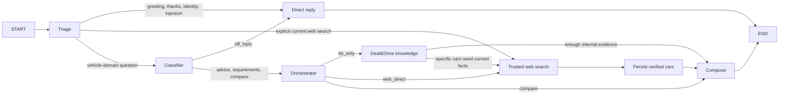

# Deal&Drive

Deal&Drive is a reverse vehicle marketplace for the United States. Instead of a buyer visiting several dealerships and repeatedly negotiating, the buyer publishes one private vehicle request and verified dealers compete with itemized out-the-door offers. The buyer compares the offers, chooses whether to open a conversation, and remains in control through acceptance and fulfillment.

The repository contains the complete React application, FastAPI service, marketplace database, Sera AI advisor, configurable agent control plane, support workspace, and deployment tooling.

## Documentation map

- [OpenAPI contract](design/openapi.yaml) — 100 documented operations, including the administrator control plane
- [Entity relationship diagram](define/schema-erd.mmd) — current 20-table SQLAlchemy model
- [Detailed running guide](RUNNING_GUIDE.md)
- Interactive API documentation after startup: `http://127.0.0.1:8000/api/v1/docs`

## Product and business model

Deal&Drive serves five application roles.

| Role | What the user can do |
|---|---|
| Buyer | Create private vehicle requests, receive and compare quotes, accept or decline an offer, request a negotiation, chat after approval, track an order, and use Sera |
| Dealer | Complete verification, browse matched buyer demand, submit/revise/withdraw itemized quotes, approve negotiation requests, chat, and update fulfillment |
| Support | Manage tickets and dealer verification queues |
| Support administrator | All support capabilities plus configuration, prompts, runtime models, themes, traces, versions, and team access |
| Admin | Full support and administrator access |

### Marketplace flow



1. A buyer creates a request manually or asks Sera to prepare an editable draft.
2. The request contains vehicle, location, radius, timing, budget, and must-have requirements. Buyer identity remains private.
3. Approved dealers see requests that match their market and submit one itemized quote per request.
4. The application calculates the out-the-door total from vehicle price, documentation fee, tax, title/registration, and trade-in credit.
5. A buyer can compare different vehicle requests or several dealer offers on the same request.
6. Contact details and free messaging remain gated until the appropriate acceptance or negotiation approval.
7. An accepted quote becomes the fulfillment record followed through paperwork, funds, dispatch, delivery, and completion.
8. Support handles tickets and dealer verification independently from administrator configuration authority.

## Application architecture



### Frontend

- React 19 and TypeScript
- Vite production build and lazy route loading
- React Router role guards and error boundaries
- Zustand session/UI state
- TanStack Query infrastructure
- React Hook Form and Zod validation
- React Markdown with GitHub-flavored tables and lists
- XYFlow for editable administrator workflow diagrams
- Motion for restrained transitions
- Responsive buyer, dealer, support, administrator, authentication, and public landing experiences

Important frontend locations:

```text
frontend/src/
├── services/generated/       # API-facing TypeScript contract
├── services/platform/        # HTTP client, session store, theme runtime
├── types/                    # Domain types
├── ui/navigations/           # Router, role guards, application shell
├── ui/reusables/             # Shared UI components
└── ui/screens/               # Buyer, dealer, Sera, support, and admin screens
```

### Backend

- Python 3.11–3.13
- FastAPI and Pydantic v2
- Async SQLAlchemy
- SQLite for local development and PostgreSQL/RDS support
- Alembic migrations
- JWT access and refresh tokens with Argon2 password hashing
- Server-sent events for Sera and administrator test runs
- WebSocket events for conversation updates
- Local/S3 document storage adapters
- Structured `structlog` logging and request IDs
- LangGraph orchestration, optional LangSmith tracing, and first-party database traces

Important backend locations:

```text
backend/
├── main.py                         # FastAPI application and startup synchronization
├── alembic/versions/               # Database migrations
└── src/
    ├── agents/                     # Sera graphs, tools, prompts, LLM client
    ├── auth/                       # JWT and Codex OAuth sources/storage
    ├── models/                     # Request and administrator Pydantic models
    ├── prompt/                     # Source-controlled prompt baselines
    ├── repositories/               # SQLAlchemy schema and data access
    ├── routes/                     # HTTP/SSE/WebSocket endpoints
    ├── services/                   # Business, AI, admin, and storage services
    └── utils/                      # Errors, logging, serialization
```

## Database model

The current schema contains 20 tables grouped by responsibility.

| Area | Tables |
|---|---|
| Identity/reference | `states`, `brands`, `profiles`, `users` |
| Marketplace | `cars`, `buyer_preference`, `buyer_requests`, `deal_quotes`, `deal_chats`, `deal_documents` |
| AI memory/operations | `conversation_history`, `llm_audits`, `ai_traces`, `ai_trace_spans`, `error_logs` |
| Support | `support_tickets`, `support_verifications` |
| Administrator control plane | `configuration_revisions`, `configuration_defaults`, `administration_audit_events` |

The complete field-level diagram is [define/schema-erd.mmd](define/schema-erd.mmd). Tables based on `AuditMixin` also contain `created_at`, `updated_at`, `created_by`, and `updated_by`.

Notable data rules:

- One dealer can submit only one quote for a buyer request; revisions update that quote.
- `deal_quotes.final_price` is computed by the database.
- Preferences are stored as one evolvable JSON document per buyer.
- AI conversation checkpoints are always scoped to the owning buyer.
- AI trace spans are deleted with their parent trace.
- Configuration revisions are immutable; publication, rollback, defaults, and deployment synchronization create auditable history.

## Sera AI system

Sera is the buyer-side AI experience. It is deliberately not allowed to publish a request, accept/decline an offer, negotiate, or reveal gated contact details for the buyer.

The UI presents three understandable capabilities:

1. **Sera advisor** — understands the buyer’s question and coordinates the response.
2. **Trusted research** — obtains current vehicle information from approved sources.
3. **Offer comparison** — compares selected vehicles or real dealer offers, including multiple offers on one request.

Internally, the LangGraph runtime uses smaller safe stages so routing, cost, and failure handling remain observable.

### Intent-driven workflow



Routing behavior:

| Intent or condition | Route |
|---|---|
| Greeting, acknowledgement, capability question, or prompt-injection attempt | Deterministic triage → one direct-reply model call |
| Explicit “search/browse/look up/current/latest” vehicle query | Triage → trusted web search → verified persistence → compose |
| Inventory, ownership, recommendation, or requirements question | Classifier → orchestrator |
| Information answerable from marketplace data | `kb_only` → knowledge agent → compose |
| Category request needing a current shortlist | `web_per_car` → knowledge shortlist → parallel per-car web research → persist → compose |
| Broad current search | `web_direct` → web research → persist → compose |
| Selected requests or offers | Comparison prompt receives only buyer-owned selected rows → compose |
| Requirement-bearing message | A parallel requirement graph extracts fields and may return an editable preview |

### Main prompt and prompt composition

The root prompt is [backend/src/prompt/main_agent.md](backend/src/prompt/main_agent.md). It is the highest-level Sera policy and defines:

- buyer control and prohibited autonomous actions;
- grounding and missing-data behavior;
- privacy/contact-gate rules;
- prompt-injection and untrusted-content handling;
- tool write boundaries;
- concise buyer-facing response style.

For pipeline nodes, the effective prompt is:

```text
main_agent.md + the selected node fragment
```

Direct-reply fragments are intentionally self-contained so a greeting does not pay for the full orchestration context.

| Prompt key | Responsibility |
|---|---|
| `main_agent` | Root safety, behavior, grounding, and response policy |
| `orchestrator` | Selects `kb_only`, `web_direct`, or `web_per_car` |
| `kb_agent` | Marketplace retrieval and shortlist instructions |
| `web_search_agent` | Trusted-source research and extraction rules |
| `compose` | Final Markdown structure, evidence, and presentation |
| `compare` | Like-for-like selected offer/vehicle comparison |
| `small_talk` | Low-cost greetings and direct replies |
| `requirements` | Structured buyer-request extraction and focused follow-up questions |

### Requirement extraction

Eligible buyer turns run a separate requirement graph in parallel with the main graph. It first extracts deterministic fields such as brand, budget, timeline, and state. If required fields remain missing, a constrained structured LLM call extracts only values the buyer actually stated. The output is either up to three focused questions or an editable request preview. It never publishes automatically.

### Trusted web search

Web research is enabled only when `AI_ENABLE_WEB_SEARCH=true`. Queries are restricted to domains in `backend/src/settings.py`. Retrieved content is wrapped and treated as untrusted data. Complete verified vehicle records can be written to the knowledge store for reuse; arbitrary crawled instructions are never executed.

### Model and credential selection

Runtime model settings come from the published administrator prompt profile. Environment values provide the developer baseline. Credential precedence is:

1. `OPENAI_API_KEY`
2. `CODEX_OAUTH_ACCESS_TOKEN`
3. `CODEX_OAUTH_CLIENT_ID` plus `CODEX_OAUTH_REFRESH_TOKEN`
4. Cached Sign in with ChatGPT state stored in S3
5. Deterministic fallback when no live credential is available

Codex OAuth JSON is not written beside the backend. It is stored under `s3://<S3_BUCKET>/<CODEX_OAUTH_S3_PREFIX>/` with S3 server-side encryption and `no-store` caching. A legacy local state file is migrated only after the S3 upload succeeds.

### Streaming protocol

`POST /api/v1/ai/chat` returns server-sent events:

- `status` — current user-facing phase;
- `token` — response text chunks;
- `card` — comparison or request-preview structured UI;
- `sources` — research evidence;
- `done` — thread identity and completion metadata.

The administrator preview stream adds `started`, live `step`, `token`, `complete`, and `error` events. Nodes do not move during execution; the active connector is the streaming visual indicator.

### AI observability

Every live or test query can record:

- complete request duration and status;
- selected intent route and configuration manifest;
- each router, agent, tool, action, and LLM handoff;
- redacted stage input and output;
- prompt sent to the model and model output;
- provider, model, reasoning effort, prompt version, and retry count;
- input/output tokens and per-stage timing;
- errors and the next handoff.

The built-in dashboard reads `ai_traces`, `ai_trace_spans`, and legacy `llm_audits`. Optional LangSmith tracing can also be enabled for external LangGraph inspection, but the administrator dashboard does not depend on it.

## Administrator control plane

`/support-administration` is available to `support-admin` and `admin` roles.

| Section | Capability |
|---|---|
| Overview | Runtime health, active workflow, drafts, recent changes, and traces |
| Workflow | Drag/reconnect approved nodes, edit route conditions, validate, test, save, and publish |
| Agents & prompts | Edit complete prompt content and test an unpublished prompt |
| Models & runtime | Choose an approved model, reasoning effort, and output-token limit per prompt profile |
| Brand theme | Edit semantic colors and inspect the actual landing/login/buyer/dealer/support UI in an isolated preview |
| Team & access | Search members and grant/remove administrator authority |
| AI logs & traces | Inspect queries, stage inputs/outputs, prompts, handoffs, models, tokens, and timings |
| Versions & audit | Activate historical versions, select/reset defaults, inspect changes, and export configuration |

Support Administrators also have a read-only workspace switcher for the real buyer and dealer interfaces. The API exposes operational request/quote projections, while every marketplace mutation keeps its original role guard; the preview therefore cannot create, revise, accept, or delete marketplace data.

### Version lifecycle

1. Editing creates only local browser state.
2. **Save draft** creates an immutable draft revision with optimistic base-version protection.
3. Validation rejects unknown nodes, invalid conditions, cycles, missing routes, unsafe models, and inaccessible theme colors.
4. **Publish** archives the previous active revision and activates the chosen draft.
5. **Activate** creates a new published rollback revision from a historical payload; history is never rewritten.
6. **Set default** selects the recovery target used by Reset.
7. Every privileged action is appended to `administration_audit_events`.

### Code changes versus administrator changes

Prompt files, default workflow, and default theme remain source-controlled developer baselines. At backend startup, `sync_code_baselines()` hashes those values:

- unchanged code produces no duplicate revision;
- changed code creates a new **Developer** version;
- all previous administrator and developer versions remain available;
- the new deployment baseline becomes an explicit auditable version rather than silently mutating an old row.

Administrator edits do **not** rewrite Python or Markdown source files. Runtime reads the published database version. This separation prevents a web request from modifying the repository and keeps source changes reviewable.

### YAML/JSON export

Use **Versions & audit → Export YAML** or **Export JSON**. The browser downloads `deal-drive-config-<timestamp>.yaml` or `.json` locally. The snapshot contains:

- active workflow nodes, positions, edges, and conditions;
- every full prompt;
- model, reasoning, and token settings for every prompt profile;
- all semantic theme colors;
- active version numbers and approved node/model catalogs.

Credentials, OAuth tokens, passwords, API keys, and database secrets are excluded. YAML is a human-readable configuration format; JSON contains the same structured information. A developer can give either export to an AI coding tool, review the resulting source changes in Git, and deploy them as a new Developer version.

## API behavior

- Base URL: `http://127.0.0.1:8000/api/v1`
- Swagger UI: `http://127.0.0.1:8000/api/v1/docs`
- Runtime schema: `http://127.0.0.1:8000/api/v1/openapi.json`
- Checked-in reviewed contract: [design/openapi.yaml](design/openapi.yaml)
- JSON success responses are envelope-free.
- JSON errors use `{"error":{"code","message","details","request_id"}}`.
- Money is transported as decimal strings.
- Access is enforced in the API, not only by frontend navigation.
- AI chat and workflow previews use SSE.
- Quote chat updates use a one-time WebSocket ticket.

## Local development

### Requirements

- Node.js 20+
- Python 3.11–3.13
- [uv](https://docs.astral.sh/uv/)
- SQLite for the default setup, or PostgreSQL for a production-like setup

### 1. Configure the backend

```powershell
Copy-Item backend/.env.example backend/.env
```

At minimum, replace `JWT_SECRET_KEY`. A live LLM key is optional because the application has a deterministic fallback.

### 2. Install and migrate the backend

```powershell
cd backend
uv sync
uv run alembic upgrade head
```

The current administration migrations are `20261003_0004` and `20261003_0005`. Development startup also calls `create_schema()` for convenience; production deployments should still run Alembic explicitly.

### 3. Optional demo data

```powershell
uv run python -m tests.demo_data
```

The seed is idempotent and intended for development only.

### 4. Start the API

```powershell
uv run uvicorn main:app --reload --host 127.0.0.1 --port 8000
```

### 5. Start the frontend

```powershell
cd ..\frontend
npm install
npm run dev -- --host 127.0.0.1
```

Open `http://127.0.0.1:5173`.

### Demo accounts

All seeded accounts use `demo1234`.

| Role | Email |
|---|---|
| Buyer | `rahul@drivedeal.demo` |
| Buyer | `adithyaa@drivedeal.demo` |
| Dealer | `naveen@naveemotors.demo` |
| Support | `maya@drivedeal.demo` |
| Support administrator | `priya@drivedeal.demo` |
| Admin | `alex@drivedeal.demo` |

## Important environment variables

| Variable | Purpose |
|---|---|
| `DATABASE_URL` | Async SQLite or PostgreSQL connection |
| `JWT_SECRET_KEY` | Access/refresh-token signing secret |
| `CORS_ORIGINS` | Allowed browser origins |
| `STORAGE_DRIVER` | `local` or `s3` document storage |
| `AWS_REGION`, `S3_BUCKET` | S3 region and bucket |
| `CODEX_OAUTH_S3_PREFIX` | Private OAuth object prefix; default `private/codex-oauth` |
| `OPENAI_API_KEY` | Primary live model credential |
| `CODEX_OAUTH_*` | Alternative Sign in with ChatGPT credential inputs |
| `OPENAI_MODEL` | Developer baseline model; published admin versions override it at runtime |
| `OPENAI_REASONING_EFFORT` | Developer baseline reasoning setting |
| `AI_DISABLED` | Skip live LangGraph/model execution and use deterministic demo streaming |
| `AI_ENABLE_WEB_SEARCH` | Enable current allow-listed web research |
| `LANGSMITH_TRACING` | Enable optional external LangSmith tracing |
| `VITE_API_BASE_URL` | Frontend REST/SSE API root |
| `VITE_WS_BASE_URL` | Frontend WebSocket URL |
| `VITE_USE_MOCKS` | Use the self-contained frontend mock client |

Never commit `backend/.env`, downloaded configuration containing business-sensitive prompt content, AWS credentials, OAuth tokens, or database passwords.

## Verification

Frontend:

```powershell
cd frontend
npm run lint
npm test
npm run build
```

Backend:

```powershell
cd backend
uv run ruff check src tests
uv run pytest -q
uv run bandit -q -r src
```

OpenAPI contract:

```powershell
cd ..
backend\.venv\Scripts\python.exe scripts\_validate_openapi.py
```

The validator checks references, unique operation IDs, path parameters, and tag declarations.

## Containers

```powershell
docker compose up --build
```

The frontend is served on port `5173`, the API on `8000`, and local database/upload directories use named volumes. Supply production secrets through a secret manager or workload identity rather than the Compose file.

## Security boundaries

- Buyer, dealer, support, support-administrator, and admin permissions are server-side role checks.
- Dealers must be approved before accessing dealer operations.
- Buyer identity and dealer contact information remain gated by marketplace state.
- Sera is advisory and cannot perform buyer decisions.
- External pages and user text are untrusted prompt data.
- Administrator graphs can reconnect only registered executable nodes; arbitrary code cannot be added from the UI.
- Workflow cycles are rejected to prevent unbounded agent runs.
- Theme publication requires readable WCAG contrast.
- Preview runs roll back marketplace writes.
- AI trace content is bounded and credential-like values are redacted.
- OAuth state is private S3 data, not a frontend document upload.

## Production checklist

1. Use PostgreSQL with TLS and restricted network access.
2. Run `alembic upgrade head` before starting the new release.
3. Store JWT, database, AWS, OpenAI/Codex, and LangSmith credentials in a secret manager.
4. Prefer workload/IAM roles over long-lived AWS access keys.
5. Use a private S3 bucket with versioning, encryption, and least-privilege policies.
6. Configure exact CORS origins and HTTPS WebSocket/SSE proxy behavior.
7. Keep `AI_DISABLED=false` only when an approved live credential and budgets are configured.
8. Review and test a draft before publishing prompts, models, workflows, or themes.
9. Monitor AI traces, application error logs, token usage, and latency.
10. Back up the database and verify rollback/default versions before each release.
